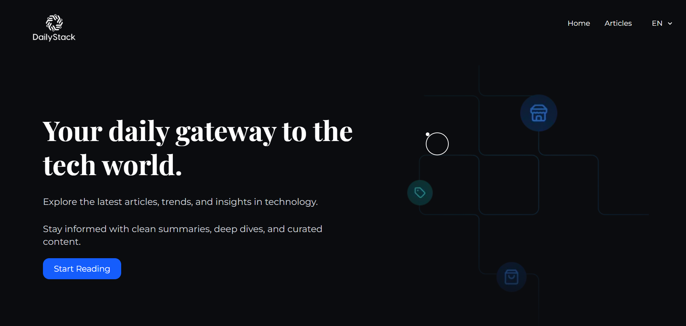

# DailStack – Your Daily Dose of Tech Updates

[](https://daily-stack-sigma.vercel.app)
[](https://github.com/KMV531/DailyStack)

Stay up to date with the **latest technology news, tutorials, tools, and industry insights**. Freshly curated for developers and tech enthusiasts.  
Powered by a **headless architecture** with automated content ingestion and high-performance rendering.



---

## ✨ Platform Features

### Content Automation

- Automated RSS article importer (Sanity + Cron)
- Auto-cleanup of old articles based on retention rules
- Incremental Static Regeneration for seamless updates

### Frontend

- Modern UI using Tailwind CSS + shadcn/ui
- Fully responsive, mobile-first layout
- Smooth transitions with Framer Motion
- SEO-optimized metadata
- High accessibility standards
- Multi-lingual support

### CMS / Admin Experience

- Sanity Studio integrated CMS
- Structured content models:
  - Articles
  - Categories
- Real-time preview support

---

## 🛠️ Technology Stack

| Layer              | Technologies                                                              | Purpose                                           |
| ------------------ | ------------------------------------------------------------------------- | ------------------------------------------------- |
| **Frontend**       | Next.js 16, TypeScript, Tailwind CSS, shadcn/ui, Framer Motion, next-intl | UI/UX, SSR, SSG, animations, internationalization |
| **Backend**        | Next.js Route Handlers, Sanity API, Resend API                            | APIs, contact handling, storing articles          |
| **CMS / Database** | Sanity v3                                                                 | Structured content storage                        |
| **Automation**     | RSS Parser, custom Node utilities                                         | Scheduled content import and cleanup              |
| **Deployment**     | Vercel                                                                    | Hosting, SSR/ISR                                  |
| **Utilities**      | Cleanup utilities, RSS normalizer, safe writer and validator              | Ensures consistent storage of articles            |

---

## 📡 Article Flow

1. Fetch RSS feed
2. Normalize entries (consistent structure)
3. Compare against existing Sanity records
4. Delete old or expired content
5. Insert new content

---

## 🏆 Platform Value

- Clean and modern professional interface
- Automated content pipeline for hands-off maintenance
- Direct communication via integrated contact form
- Fast, accessible, SEO-ready, and globally optimized

---

## 💻 Developer Setup

1. Clone the repository

   ```bash
   git clone https://github.com/KMV531/DailyStack.git

   ```

2. Install dependencies:

   ```bash
   npm install --legacy-peer-deps

   ```

3. Set up environment variables (create .env):

   ```bash
   SANITY_PROJECT_ID=your_project_id
   SANITY_DATASET=production
   SANITY_API_READ_TOKEN=your_read_token
   SANITY_API_WRITE_TOKEN=your_write_token

   ```

4. Run development server:

   ```bash
   npm run dev

   ```

5. Run RSS import:
   ```bash
   npm run import-nextjs
   ```
